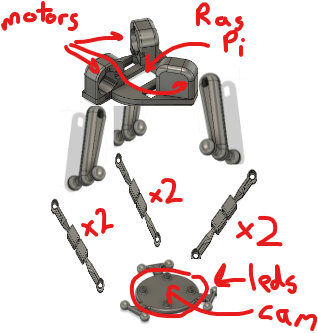
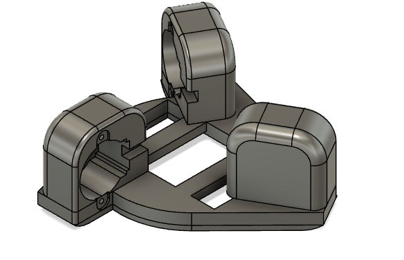
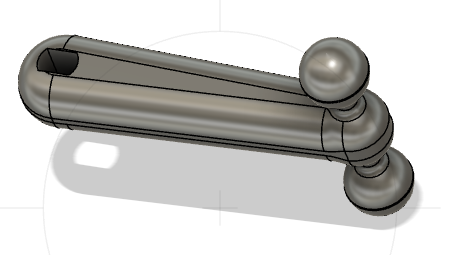
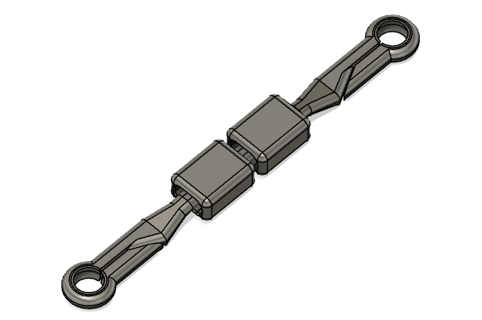
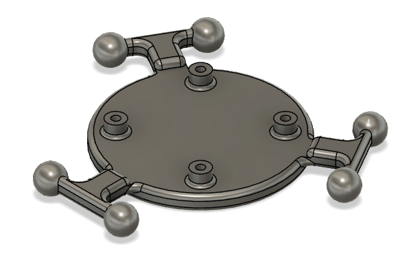

# Delta Robot

## Description
A simple and cheap delta robot which can be used to move a camera around, take photos, and stream video to a self-hosted webpage.

FAIR WARNING: I did a very bad job organizing and documenting this project at the time it was created. I no longer have the components to re build or re-test this project. There are no photos and definitely some bugs you will have to figure out. That said, I did successfully build this robot and i did get it working (just possibly not with this exact code seeing as i didn't really know/use git back then) SORRY!. Hopefully there are some salvageable parts of this project for you but it won't be an out-of-the box packaged success tutorial sort of project.

## Table of Contents
* [Materials](#materials)
* [Design](#design)
* [Theory](#theory)

## Materials
#### Delta Robot Requirements
* 3x 28BYJ-48 Stepper Motors [$9.99 on Amazon](https://a.co/d/1H8w173)
  * These motors are great if you don't need a lot of torque. They are dirt cheap and come with the driver attached, so all you need is the ability to send logic level signals to them.
  * You can drive them from the GPIO pins of a Raspberry Pi, Arduino, or ESP32.
* A 3D printer to print the parts [$347.99 Creality Ender 3 Pro](https://a.co/d/giijayi)
  * I used a Creality Ender 3 Pro, but any 3D printer should work.
* PLA filament [$25.99 Hatchbox PLA](https://a.co/d/dkJQ1mc)
  * I used Hatchbox PLA, but any PLA should work.
* Microcontroller to drive the motors and the camera
  * I used Raspberry Pi [$61.78 Raspberry Pi 4](https://a.co/d/7z3z3Zp)
  * Probably could be done with [$7.99 ESP32 Wifi/BLE](https://a.co/d/bNuEp17)
    * I have used this for driving the motors and i have hosted webpages from it, but I have not used it for camera or streaming video.

### Additional Materials
* [$15.99 Raspberry Pi Camera](https://a.co/d/0xqtnDU)
* [$15.99 NeoPixel LED Ring (for lighting the camera)](https://a.co/d/7z3z3Zp)

## Design
I built this robot 3 years ago but unfortunately can't find photos of the original build :(.

I also either never made a CAD assembly or I lost it. Excuse the terrible photoshopped images.

#### Head & Shoulders (x1)
Basically a mount for the 3 steppers and the raspberry pi. Important thing is that the steppers are mounted at 120 degree angles from each other.

#### Biceps (x3)
The biceps are the arms that connect the steppers to the end effector. They are connected to the steppers with a ball joint and to the end effector with a ball joint (elbow).
The biceps are printed with ball joints for the elbow.

#### Forearms (x6)
The forearms connect the bottom mount (hand) which is ultimately what moves. 
The forearms are printed with compliant socket joints and pieces to lock them in place.

#### Hand (x1)
This is the platform where the camera is mounted and it is ultimately what moves. The hand is printed with ball joints for the forearms to attach to.

## Theory

### What is a delta robot?
[Wikipedia subs it up well](https://en.wikipedia.org/wiki/Delta_robot).

Basically using only 3 motors you can move a platform in 3D space. The motors are mounted at 120 degree angles from each other and the platform is connected to the motors with arms. The motors are connected to the platform with ball joints and the platform is connected to the arms with ball joints.

### Kinematics
[Marginally Clever](https://www.marginallyclever.com/other/samples/fk-ik-test.html) has a good kinematics calculator for delta robots.

### Code

### cam - tools for driving a raspberry pi camera and neopixel led ring
* `cam.py` - extends the picamera and adds utilities for overlaying an image on top of the camera stream.
* `leds.py` - tools for driving a neopixel led ring.
* `stream.py` - a flask app for streaming the camera feed to a self-hosted webpage. Not sure if this works anymore, although some version of it did work at some point.

### motion - tools for commanding the delta robot in 3D space
* `kinematics.py` - PROBABLY THE MOST USEFUL FILE: tools for calculating the forward and inverse kinematics of the delta robot.
* `stepper.py` - tools for driving the 28BYJ-48 stepper motors.
* `robot.py` - a class for commanding the delta robot in 3D space.

### tools - tools for the robot
* `key_controls.py` - a simple script for attaching keyboard listener functions
* `load_config.py` - a simple script for loading a json config file into the python objects used by the robot.
* `log.py` - a simple script for logging messages with color

* `robot.py` is the main script for commanding the robot. It attaches keyboard listener functions to allow moving the robot in 3D space
* `config.json` is a simple json file for configuring the robot. It is loaded by `load_config.py` and used by `robot.py`
